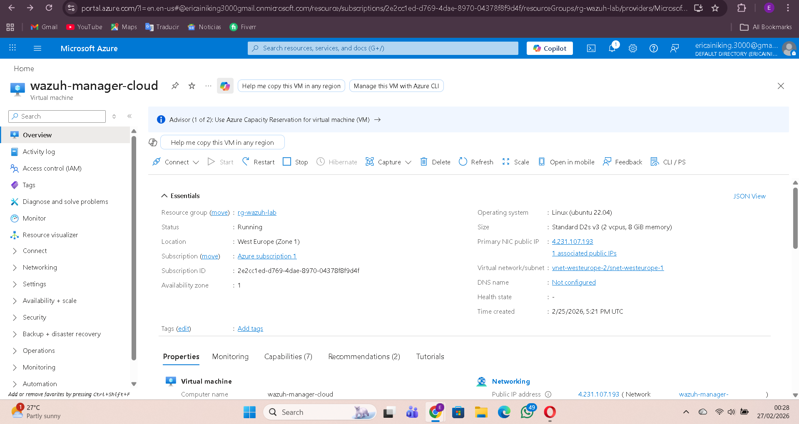
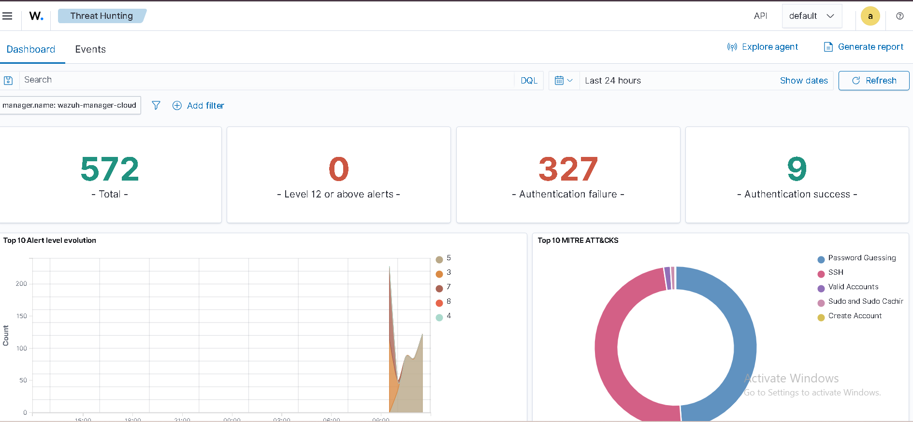
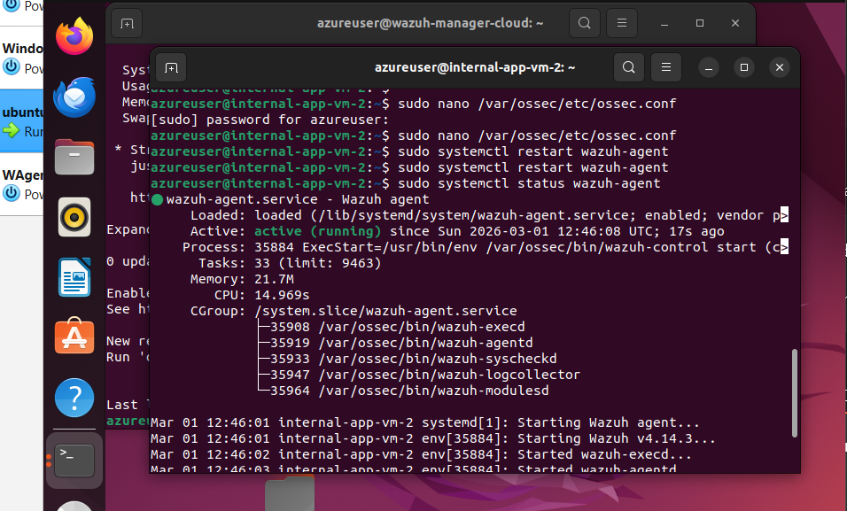
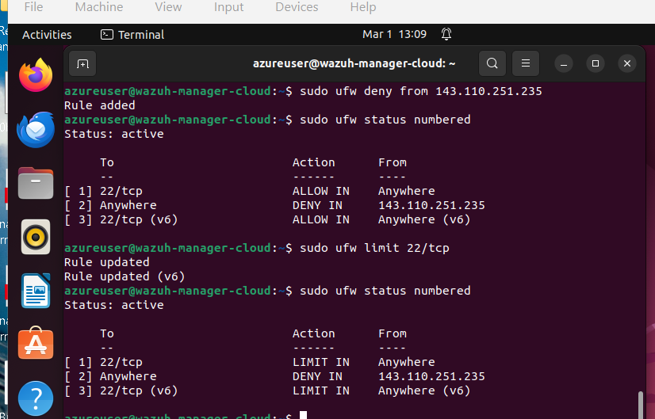
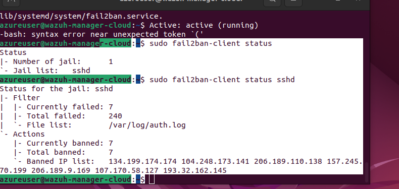

# Cloud Security Infrastructure Lab

## Project Overview

This project demonstrates how to build a basic **cloud security monitoring infrastructure** using Microsoft Azure, Wazuh, and Linux security tools.

The goal of this lab was to simulate real-world attack attempts and monitor how security tools detect and respond to those threats.

This project includes:

* Cloud infrastructure deployment
* Security monitoring using Wazuh
* SSH attack detection
* Firewall protection using UFW
* Automated attack blocking using Fail2Ban

---

## Architecture

The lab environment includes:

* **Azure Virtual Machine (Ubuntu 22.04)**
* **Wazuh Manager**
* **Wazuh Agent**
* **Fail2Ban intrusion prevention**
* **UFW firewall configuration**

Security events are monitored and visualized in the **Wazuh dashboard**.

---

## Security Tools Used

| Tool            | Purpose                      |
| --------------- | ---------------------------- |
| Microsoft Azure | Cloud infrastructure         |
| Wazuh           | Security monitoring and SIEM |
| Fail2Ban        | Automated attack blocking    |
| UFW             | Linux firewall               |
| SSH logs        | Authentication monitoring    |

---

## Attack Simulation

During testing, multiple failed SSH login attempts were generated to simulate brute-force attacks.

The system successfully detected:

* Invalid login attempts
* Authentication failures
* Unauthorized access attempts

These events were logged and visualized in the Wazuh dashboard.

---

## Security Detection Results

The system detected and logged several attack attempts including:

* Brute force SSH login attempts
* Invalid user authentication
* Unauthorized login activity

Fail2Ban automatically banned malicious IP addresses after repeated failed login attempts.

---

## Screenshots

### Azure Virtual Machine

### Wazuh Dashboard

### Wazuh Agent Status

### UFW Firewall Rules

### Fail2Ban Protection

---

## Key Learning Outcomes

Through this project I learned how to:

* Deploy a Linux server in the cloud
* Configure security monitoring infrastructure
* Detect suspicious login attempts
* Configure firewall rules
* Automate threat response using Fail2Ban
* Monitor security alerts using Wazuh

---

## Future Improvements

Future improvements to this lab could include:

* Multi-agent monitoring
* SIEM alert automation
* Threat intelligence integration
* Security automation using scripts
